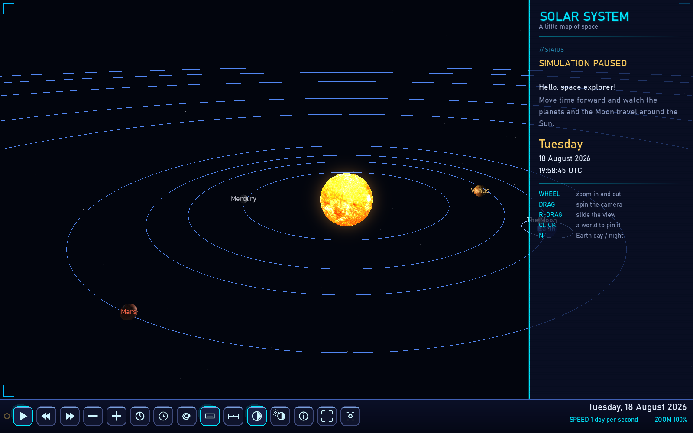
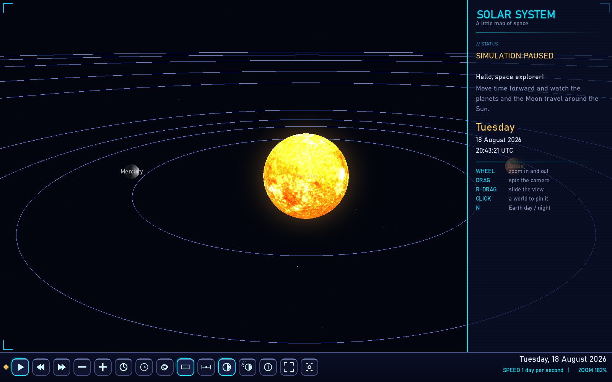
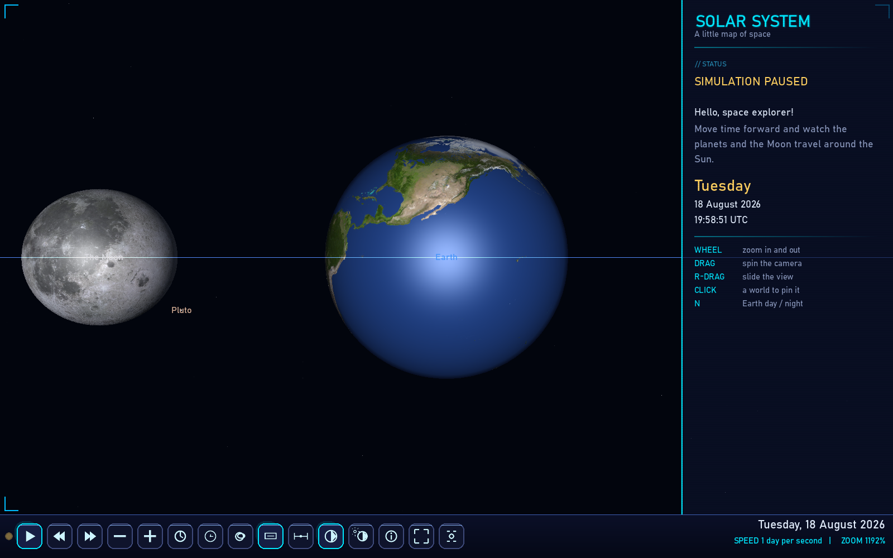
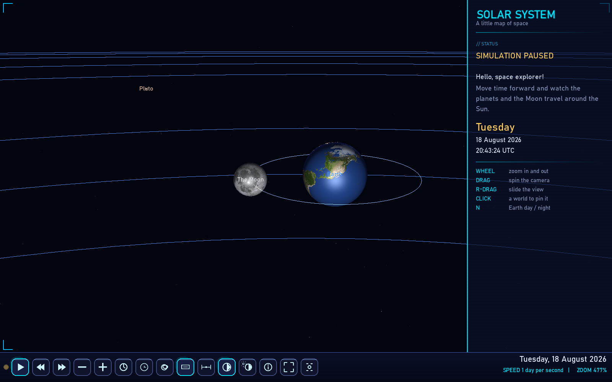
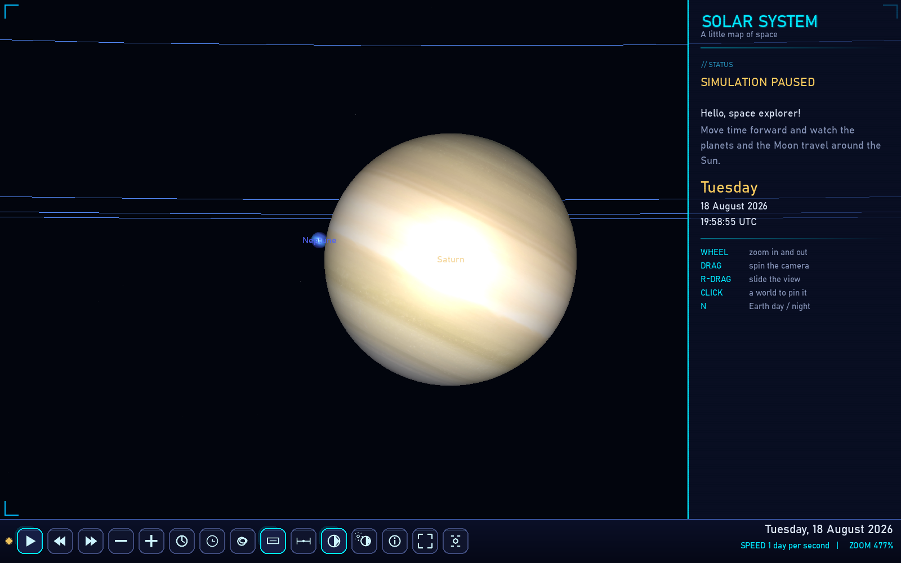
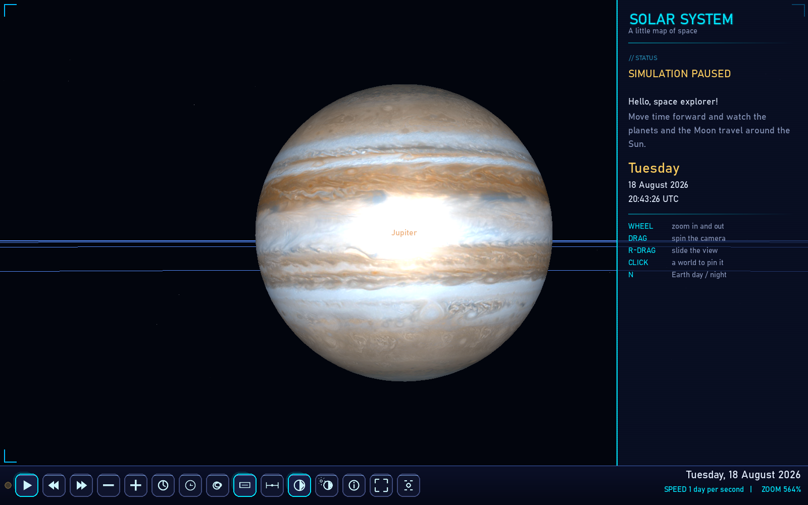
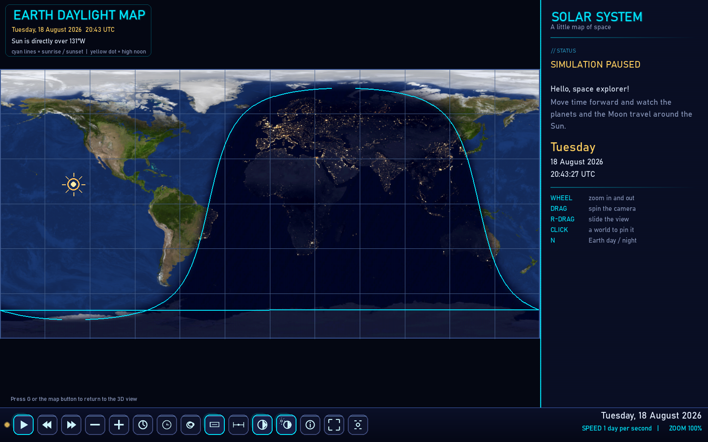

# Tiny Solar System 3D

A colourful, kid-friendly **3D Solar System** explorer built with **pygame + ModernGL** — plus a flat **2D Earth daylight map** view.





The Solar System is rendered as real textured spheres: the Sun with a glowing
corona, every planet on its orbit ring, Saturn's ring, and an Earth that shows
**real city lights on its night side**. Positions come from the vendored
`solarsystem` library every frame, so you can scrub time forward and watch the
planets and the Moon travel around the Sun — in three dimensions.

## Quick start

The easiest way to run it is the ready-made Windows build: download
**`TinySolarSystem3D.exe`** from the Releases page and double-click it -
no Python required.

To run from source you need **Python 3.8+** and a GPU that supports
**OpenGL 3.3**.

```
pip install -r requirements.txt
python solar_system.py
```

The layout is resolution-independent and scales to fit any display, tuned for
**1280 x 800**. It launches in a window; drag the window edges to resize, or
press `F11` for true fullscreen.

## What you see


- **Textured planets** — real NASA maps (Solar System Scope, CC-BY) wrapped
  around 3D spheres, lit by the Sun so every world has a real day/night
  terminator.
- **The Sun** — a bright emissive sphere with a warm additive corona and glow.
- **Saturn's rings** — a textured ring around Saturn, tilted with the planet.
- **Orbit rings** around every world, plus the Moon's orbit around Earth —
  thin, glowing lines colour-coded to the app's theme.
- **A day / night Earth** — press `N` or the day/night button to switch the
  city lights on the dark side on and off.
- **A starfield** behind the Sun you can fly past.
- **More worlds** — a button (or `D`) adds the dwarf planets Ceres and Eris
  and the centaur Chiron.





- **A kid-friendly panel** — hover over a world to learn a fun fact, click to
  pin it (the camera follows it), and see its real distance from the Sun and
  Earth and its orbit time.
- **Names, distances and an About box**, a glowing HUD, fullscreen mode, and a
  taskbar with play / pause, time travel and speed controls.





### The Earth daylight map (2D view)



Press **`G`** (or the map button) to switch to a separate flat **2D view of
Earth**. It shows the full planet as an equirectangular map with the real
day and night regions at the current simulation time:

- a soft **terminator** sweeping across the map as the clock runs, with cyan
  **sunrise / sunset** lines;
- **city lights** glowing on the night side;
- the exact spot where the **Sun is directly overhead** (the sub-solar point)
  marked with a yellow sun - computed from the Sun's apparent right ascension
  versus Greenwich sidereal time, so the **equation of time** is included and
  high noon stays accurate to a fraction of a degree all year;
- a 30° **latitude / longitude grid**, the date and time, and the longitude
  currently at high noon.

The map follows the sim clock, so speeding up time makes the day/night
boundary creep around the globe — a great way to see why it's daytime in one
place and night on the other side of the planet. Press `Esc`, `G`, or the
button again to return to the 3D view.

## Controls

| Input                 | Action                                            |
| --------------------- | ------------------------------------------------- |
| Drag on the 3D view   | orbit the camera around the system                |
| Right / middle drag   | slide the view (pan)                              |
| Mouse wheel           | zoom in (up) / out (down), towards your pointer or the pinned world |
| Click a world         | pin it — the camera follows it; click empty space to unpin |
| `PLAY` / `Space`      | play / pause the sim clock                        |
| `rewind` / `forward`  | jump one day back / forward                       |
| `←` / `→` (hold)      | scrub time — realtime: 1 h/s, otherwise 2× current speed |
| `slower` / `faster`   | change sim speed (6 hours/s ... 1 year/s)         |
| `realtime` / `T`      | toggle **realtime** mode — 1 sim second = 1 real second |
| `Today` / `R`         | jump back to real time                            |
| `worlds` / `D`        | toggle the extra dwarf worlds                     |
| `labels` / `L`        | names on / off                                    |
| `distance` / `M`      | show distances from the Sun                       |
| `N`                   | Earth day / night (city lights) toggle            |
| `G`                   | switch to the 2D Earth daylight map view (and back) |
| `I`                   | About box                                         |
| `fit` / `Home`        | reset the camera                                  |
| `F11` / `F` button    | toggle fullscreen                                 |
| drag window edge      | resize (HUD re-scales live)                       |
| `Esc` / quit button   | close the app (in the map view: back to the 3D view) |

> **Realtime mode:** while active, the sim clock advances one second for every
> real second, so the planets creep along almost as slowly as they do in
> reality. Pressing `slower` / `faster` turns it off and returns to the preset
> day-per-second speeds.

## Scene scale

The scene is stylized (not to real scale) so everything stays visible: orbits
grow like `semi-major-axis^0.65` and planet sizes like `sqrt(radius)`, while
the *positions* are the real heliocentric ones from the `solarsystem` library.
The world coordinates are shifted so the Sun sits at the origin.

## The astronomy under the hood

- **Positions** come from the vendored `solarsystem` library (Paul
  Schlyter's low-precision planetary theory) every frame.
- **Earth's 3D spin phase** is solved from the sub-solar geometry each
  frame, so the day/night terminator and city lights on the 3D globe
  line up exactly with the 2D daylight map.
- **The 2D map's sub-solar point** uses the Sun's apparent right ascension
  versus Greenwich mean sidereal time — the **equation of time** is included,
  so high noon lands within a fraction of a degree of reality all year.
- **The Moon** orbits with its real 5.1-degree inclination, and its orbit
  ring is fitted in the Moon's true (slowly precessing) orbital plane.
- **Earth's tilt axis** is fixed in inertial space, so the 3D globe shows
  real seasons.

Silently reproducible, so you can batch screenshots headlessly:

```
python solar_system.py --shot shots_3d/scene_default.png    # 3D view
python solar_system.py --lightmap shots_3d/daylight_map.png  # 2D map view
```

Composite captures go through `snap_display()`, which re-rotates the display
read-back 180° (sideways + upside) so the saved PNGs are upright — the
`shots_3d/` images were generated this way.

## Tests

A `unittest` suite lives in `tests/` — pure math/geometry checks plus a
headless engine smoke test (it renders real frames off-screen and regression-
tests the Saturn ring, snapshot orientation, orbit drag and wheel directions,
the orbit-ring buffer, ephemeris caching, the sub-solar math and the Moon's
inclined orbit).

```
python -m unittest discover -s tests -v
```

The engine tests use the SDL *dummy* video driver and need an OpenGL 3.3
context; on machines without a GPU they are skipped automatically.

## Files

| File            | Purpose                                        |
| --------------- | ---------------------------------------------- |
| `solar_system.py` | the app: HUD, panel, taskbar, camera controls, sim clock, daylight map view |
| `scene3d.py`    | the 3D engine: shaders, spheres, corona, orbit rings, Saturn's ring, starfield |
| `vendor/solarsystem/` | Paul Schlyter's planetary-position library (vendored) |
| `textures/`     | the Solar System Scope maps + NASA LORRI Pluto |
| `shots_3d/`     | example screenshots from the headless renderer |
| `tests/`        | the unittest suite (run with `python -m unittest discover -s tests -v`) |
| `TinySolarSystem3D.spec` | PyInstaller recipe for the single-file Windows build |

## Building the Windows `.exe`

The single-file release build is made with
[PyInstaller](https://pyinstaller.org/):

```
pip install pyinstaller
pyinstaller TinySolarSystem3D.spec
```

`dist/TinySolarSystem3D.exe` is fully self-contained (Python, pygame,
NumPy, ModernGL and every texture inside one file) — attach it to a GitHub
Release and it runs on any 64-bit Windows 10+ machine with OpenGL 3.3.

## Credits

- **Orbital model** — Paul Schlyter's *[How to compute planetary positions](https://stjarnhimlen.se/comp/ppcomp.html)*, vendored as the `solarsystem` package (MIT, © Ioannis Nasios). It computes heliocentric planet positions, the Moon's position and phase, and sunrise/sunset.
- **Textures** — free equirectangular maps from [Solar System Scope](https://www.solarsystemscope.com/textures/), licensed under [CC BY 4.0](https://creativecommons.org/licenses/by/4.0/). Pluto's map is the NASA/JPL LORRI global mosaic.
- **Inspiration** — the 3D scene architecture and neon-HUD style come from [moon-watch-3d](https://github.com/incredibleamir-dot/moon-watch-3d); the kid-friendly design from the original 2D [tiny-solarsystem](https://github.com/incredibleamir-dot/tiny-solarsystem).
- Coded with love by Amir for Aiman.